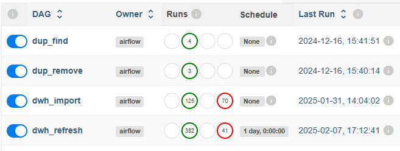
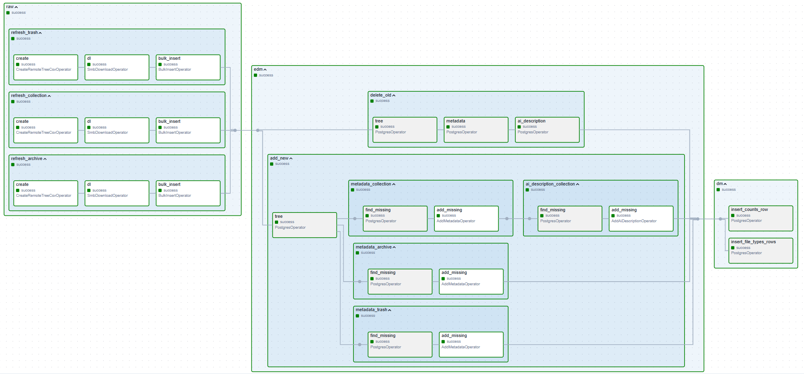
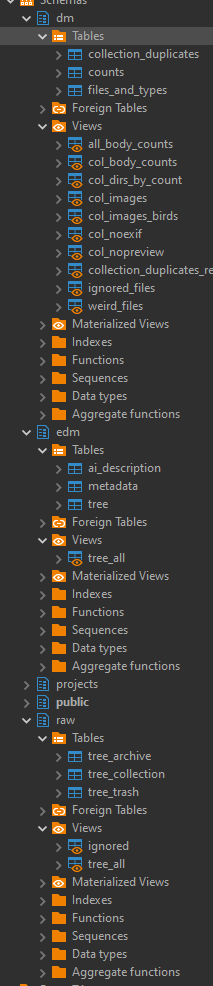
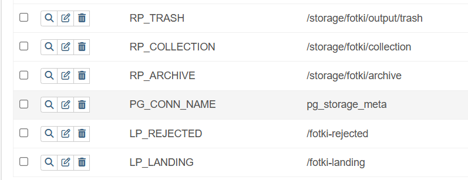

# Fotki DWH  – images (meta)data warehouse backend

## Requirements

- **Main storage**: Linux/BSD server with Samba and SSH
- **Database for metadata**: PostgreSQL
- **Processing environment**: Apache Airflow
- **Notifications**: Telegram bot

## Abilities
- **Images Import**, supports companion files such as .mp4 for Live Photos
- **Auto-created *yyyy-mm-dd* subdirectories for newly imported files**
- **Main storage indexing, Metadata refresh**
- **AI-generated captions**
- **Duplicate search**
- **Duplicate semi-automatic removal**
- **Data Marts for custom image search and collection analysis**

## Airflow DAGs

* **dup_find** - find duplicates in metadata database, save results to dm.collection_duplicates table.
* **dup_remove** - iterating over dm.collection_duplicates where 'delete' flag is set to True. It removes actual duplicate files and related metadata records.
* **dwh_import** - import new files from LP_LANDING path to RP_COLLECTION path. Moves duplicates to LP_LANDING. Triggers dwh_refresh, and notifies user by Telegram bot

* **dwh_refresh** - refresh metadata database, update datamarts

## Database structure

* **dm**  - data marts
* **edm** - enhanced data model layer
* **raw** - truncated-on-each-run tables representing remote filesystem structure

### EDM tables
* **tree** - all known files
* **metadata** - linked to tree, contains previews and exifs
* **ai_description** - linked to tree, contains ai-generated captions (captures are generated from preview stored in 'metadata' table)

### DM tables and views
* **collection_duplicates** - duplicates, filled by **dup_find** DAG
* **counts** - file counts, updated at the end of each **dwh_refresh** DAG run
* **files_and_types** - file type counts, updated at the end of each **dwh_refresh** DAG run
* **all_body_counts** - images, shutter counts by camera body and serial number
* **col_body_counts** - same, but only in RP_COLLECTION
* **col_dirs_by_count** - largest directories by file count (file list included)
* **col_images** - all images from RP_COLLECTION, preview bytes and AI-generated caption included
* **col_images_birds** - same as above but only with 'bird' substring in AI-generated caption column
* **col_noexif** - files in RP_COLLECTION with no EXIF data extracted
* **col_nopreview** - files in RP_COLLECTION without preview 
* **collection_duplicates_repeated_imports** - candidates for removal, automatically extracted from collection_duplicates
* **ignored_files** - for debugging purpose - existing files, usually non-images, which are not processed
* **weird_files** - for debugging purpose - same as above, but grouped by file type (extension)

## Airflow variables
### Locations
LP - Local Path
RP - Remote Path
- **LP_LANDING**:    local path (inside Airflow Docker container) for new items directory (manually added new media files which should be imported)
- **LP_REJECTED**:   local path (inside Airflow Docker container) for duplicates coming from LP_LANDING
- **RP_ARCHIVE**:    remote path to legacy files storage
- **RP_COLLECTION**: remote path to main storage, it is a target location for imported files coming from RP_LANDING
- **RP_TRASH**:      remote path to 'removed' files

### Connector variables
- **PG_CONN_NAME** Airflow PostgreSQL Database connector name
- **SMB_CONN_COLLECTION**, **SMB_CONN_ARCHIVE** and **SMB_CONN_TRASH** - Airflow Samba connectors names to access Archive, Collection and Trash files.
- **SSH_CONN_NAME** - Airflow SSH connector name to access remote file server. 
### Other variables
- **TG_LANDING_BOT_TOKEN**: Telegram bot token
- **TG_USER_IDS**: Users no notify using the Telegram bot

## Airflow Connections
- Conn id = **PG_CONN_NAME** - PostgreSQL connection to the database
- Conn id = **SMB_CONN_ARCHIVE** - Samba connection to Archive share
- Conn id = **SMB_CONN_COLLECTION** - Samba connection to Collection share
- Conn id = **SMB_CONN_TRASH** - Samba connection to Trash share
- Conn id = **SSH_CONN_NAME** - SSH connection to file server (which is providing Archive, Collection and Trash shares)

## Limitations
* RP_ARCHIVE (accessed by SMB_CONN_ARCHIVE), RP_COLLECTION (accessed by SMB_CONN_COLLECTION) and RP_TRASH (SMB_CONN_TRASH) should be on the same remote server because there is only one SSH connector named SSH_CONN_NAME  

