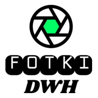

# Fotki DWH 

## Short Description

A digital asset management (DAM) system powered by Airflow ver.3, ZFS, PostgreSQL, and MinIO. Optimized for working with photos.

There is no graphical user interface, with the exception of MinIO (for consistent file uploads) and Airflow for managing system processes.

Data marts in PostgreSQL are available for analyzing digital assets.

# What can this system do?

## Import

The system can quickly detect new media files in a bucket. Duplicates and unsupported files are moved to the appropriate buckets for further manual analysis. New files are moved to the ZFS storage via Samba, then indexing starts.

## Indexing

Tables in PostgreSQL schema named 'core' contains all necessary information about indexed digital assets. Metadata including EXIF, AI description, previews are available in the database. Indexing delay for new files has been optimized, but import has more priority than indexing.

## Storage Management

- Automatic ZFS snapshots
- Duplicate Search
- Duplicate Removal

It's recommended to have zfs-snapshot-based backup to a standby storage server.

## Data Marts

Various data marts (PostgreSQL views) are updated automatically after each import and on a fixed schedule.

## Working with data

Working with mutable assets has not been tested. It is recommended to use network access, such as Samba, to access data. To make accessing data that meets specified criteria easier, Airflow Dag has been implemented. It creates symbolic links to files found in the ZFS. Note that it is recommended to configure the Samba server to support symbolic links.

# Use cases

This DAM system has been successfully installed in two local photo studios. It's running in production since late 2024.